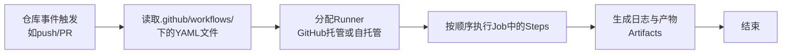

+++
title = "GitHub Actions 学习笔记"
date = "2025-11-02T15:00:00+08:00"
draft = false
tags = ["GitHub Actions", "CI/CD"]
categories = ["工程技术"]
summary = "GitHub Actions 学习笔记，包括核心概念、工作流程、语法精要、环保变量、Secrets、常用 Actions 和安全最佳实践"
+++

# GitHub Actions 学习笔记

## 什么是 GitHub Actions？

GitHub Actions 由 GitHub 平台提供，用于 CI/CD，通过创建自定义 Workflows，从 GitHub 仓库源代码触发 push/PR 时，执行 `Lint/Test/Build/Deploy` 等。

## 为什么要学习它？

标准化开发流程，用统一的环境执行 `Lint/Test` 保证正确 CI，自动化 Build 及打包。

**使用场景**

1.  **个人博客**：如基于 Hugo 搭建的网站，只需要本地写好 md 文件，git push 后通过 GitHub Actions 自动执行页面生成。
2.  **所有需要测试的项目**：保证新代码不会破坏原有功能。
3.  **需要打包的应用开发项目**：通过 git tag 自动构建产物。
4.  **维护项目**：当他人提 Issue 或 PR 时，回复消息与为 Issue 打 Triage 标签。

## 学习到什么程度？

对于正常开发者（非运维工程师），需要能够熟练使用 CI/CD，而非精通搭建复杂 CI/CD 架构。

**基础学习目标**

1.  **看懂 GitHub Actions 日志**：当看到 ❌ 时，能够点进去找到哪一步出错。
2.  **能看明白 `.github/workflows/` 下的文件。**
3.  明白 `secrets` 怎么用，在哪里设置。
4.  了解常用 Actions：如 `actions/checkout`, `actions/setup-node` 等。
5.  **能为个人项目写简单 CI/CD。**
6.  能简单修改并拓展当前 CI/CD 文件。

## 详细学习笔记

### 核心概念

GitHub Workflow 由 Jobs 组成，每个 Job 包含一系列 Steps，每个 Step 可以运行 Shell 脚本或 Action。

-   **Workflow**：可配置的自动化流程，由一个或多个 Job 组成，通过 YAML 文件定义。
-   **Event**：触发 Workflow 运行的事件，例如 `push`、`pull_request` 或 `issue` 被创建。
-   **Job**：同一 Runner 上执行的一系列 Steps。默认情况下，Jobs 并行运行，但可以配置依赖关系。
-   **Step**：Job 中的单个执行任务，可以运行命令或使用 Action。
-   **Action**：可重用的代码单元，用于执行特定任务，如设置依赖项、运行测试。
-   **Runner**：运行 Workflow 的服务器。GitHub 提供 Ubuntu Linux、Microsoft Windows 和 macOS Runner，也可以自托管。

### GitHub Action 工作流程



### Workflow 语法精要

Workflow 文件是 YAML 格式，位于 `.github/workflows/` 目录下。

#### 基本结构

```yaml
name: Workflow 名称
on: # 触发事件
  push:
    branches:
      - main
jobs:
  job_id:
    runs-on: runner类型 # 如 ubuntu-latest
    steps:
      - name: Step名称
        uses: actions/checkout@v5 # 使用Action
      - name: Run a script
        run: echo 'Hello World'
```

#### 常用触发事件

-   `push`: 代码推送到仓库时触发。
-   `pull_request`: 创建或更新 PR 时触发。
-   `issues`: Issue 被创建、编辑等时触发。
-   `schedule`: 按计划时间触发（使用 cron 语法）。
-   `workflow_dispatch`: 手动触发。

可以使用 `types` 关键字指定活动类型，或使用 `branches`、`paths` 等过滤器进一步精确控制触发条件。

#### Jobs 与 Steps

-   **Jobs**：
    -   默认**并行**运行。
    -   可通过 `needs` 关键字设置依赖关系，实现顺序执行。
    -   可使用 matrix 策略运行多个变量组合的 Job。
-   **Steps**：
    -   按**顺序**在同一个 Runner 上执行。
    -   可以共享数据。
    -   常用 Action：
        -   `actions/checkout@v5`：检出仓库代码。
        -   `actions/setup-node@v6`：设置 Node.js 环境。
        -   `actions/cache@v4`：缓存依赖以加速构建。

### 环境变量与 Secrets

-   **环境变量**：用于存储非敏感配置信息，可在 Workflow 中通过 `env` 上下文引用。
-   **Secrets**：用于存储敏感信息（如 API 密钥、密码）。
    -   在仓库的 `Settings > Secrets and variables > Actions` 中设置。
    -   在 Workflow 中通过 `${{ secrets.SECRET_NAME }}` 引用。
    -   GitHub 会自动对 Secrets 进行掩码处理，避免在日志中泄露。

### 常用 Action 与技巧

#### 缓存依赖

```yaml
- name: Cache Node.js modules
  uses: actions/cache@v4 # 使用 `actions/cache` 可以缓存依赖项，显著加速 Workflow。
  with:
    path: ~/.npm
    key: ${{ runner.os }}-node-${{ hashFiles('**/package-lock.json') }}
    restore-keys: |
      ${{ runner.os }}-node-
```

#### 使用 Artifacts

Artifacts 用于在 Workflow 之间或运行完成后传递和保存文件。

```yaml
- name: Upload artifact
  uses: actions/upload-artifact@v4
  with:
    name: my-artifact
    path: path/to/file
```

### 安全最佳实践

1.  **最小权限原则**：为 `GITHUB_TOKEN` 只授予必要的权限。
2.  **使用 OIDC**：通过 OpenID Connect 进行云部署，避免长期存储凭证。
3.  **谨慎使用第三方 Action**：优先使用官方或可信的 Action，**固定版本号**（如 `@v4` 而非 `@main`）。
4.  **敏感信息处理**：始终使用 Secrets 存储敏感数据，避免硬编码。

### 调试与故障排除

-   **查看日志**：点击 Workflow 运行中的失败 Step，查看详细日志。
-   **启用调试日志**：可设置 `ACTIONS_STEP_DEBUG` 和 `ACTIONS_RUNNER_DEBUG` secret 为 `true` 来获取更详细的日志。
-   **使用 `actions/checkout` 的 `fetch-depth`**：默认只获取最新提交，如需完整历史可设置 `fetch-depth: 0`。

## 具体实践

-   [Github动手仓库](https://github.com/mengdehong/Workflows)

---

> 💡 **小贴士**：GitHub Actions 对公开仓库的标准 Runner 免费提供，私有仓库则有免费额度。Windows 和 macOS Runner 的消耗分钟数是 Linux 的 2 倍和 10 倍，优先选择 Linux Runner 可节省成本。

